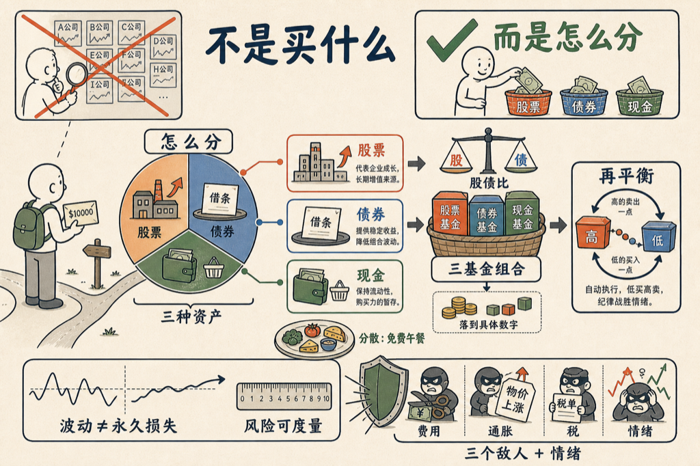

常有人问我：有一万美金，该买哪只股票？

这个问题本身就问错了。真正的问题不是买什么，而是怎么分。配置决定了你大部分的收益，和几乎全部的睡眠质量。

我让 VoiceDrop 把这件事从头讲到底，写成了一本书：《一万美金怎么分》，十二章，写给刚入市的小白。

书里把几件事讲透了：

- 股票是公司的碎片，债券是借条，现金是购买力的暂存——三台不同的发动机。
- 波动不等于永久损失，风险可以被度量。
- 分散是天下唯一的免费午餐：降风险，不降收益。
- 三基金组合，股债比怎么定，一万美金怎么落到具体数字。
- 再平衡是自动的低买高卖，把纪律变成机器。
- 三个敌人：费用、通胀、税。第四个最难对付：你自己的情绪。

先说实话：这本书是 AI 写的。我出题，几个 AI 代理分头写、互相审校。它不荐股，也不预测行情——正因为如此，里面的东西十年后还成立。

书就嵌在下面，点卡片直接读：

<mp-miniprogram data-miniprogram-appid="wxedfbd113b545b4f6" data-miniprogram-path="/pages/book-reader/index?slug=asset-allocation-10k&title=%E4%B8%80%E4%B8%87%E7%BE%8E%E9%87%91%E6%80%8E%E4%B9%88%E5%88%86&main=%E4%B8%80%E4%B8%87%E7%BE%8E%E9%87%91%E6%80%8E%E4%B9%88%E5%88%86&author=%E7%8E%8B%E5%BB%BA%E7%A1%95&cover=1&coverAt=1787841591863" data-miniprogram-title="一万美金怎么分" data-miniprogram-imageurl="http://mmbiz.qpic.cn/mmbiz_jpg/x701icxIMoQMueQVwZUq1CTqe48g269ChEnMvKANLm5NfLVe8mJK5HOqq7DX18gfYbvUpp1tzFO5sibaUSbLLp79Jadq305hhIhQBXoN2aNrE/0?wx_fmt=jpeg"></mp-miniprogram>

配置比选股重要。

