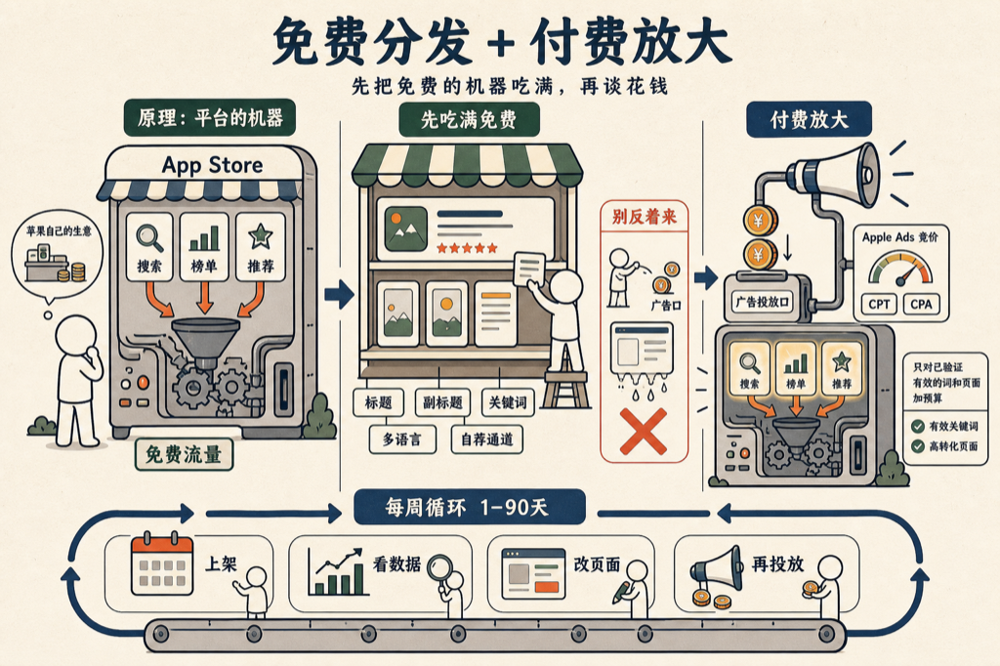

我自己上架 App 的时候，把 App Store 能给的免费流量摸了一遍：搜索、榜单、编辑推荐，连苹果官方的自荐通道都填过。

摸完的结论是一句话：App Store 是一台「免费分发 + 付费放大」的增长机器。免费的先吃满，付费的只用来放大已经被验证过的东西。

顺序不能反。大部分人是反着来的：产品一上线就急着买量，钱花出去了，产品页却还没准备好接住人。

我把这套东西丢给 VoiceDrop，让他写成了一本书：《让 App Store 替你卖货》，十六章，写给独立开发者和小团队。

书里几个我觉得值回时间的地方：

- 苹果为什么愿意免费给你流量：App Store 是苹果自己的生意，看懂它的动机，才知道怎么讨好它。
- 标题、副标题和那 100 个字符的关键词，要当货架来摆，还可以薅多语言的免费词。
- 编辑推荐不是玄学，苹果有官方自荐通道，提名怎么填命中率高。
- Apple Ads 的竞价是第二价格拍卖，用 CPT 和 CPA 判断一个词该不该继续买。
- 最后把这些拼成一个每周循环，从上架第一天排到第九十天。

先说实话：这本书是 AI 写的。我出题，几个 AI 代理分头写、互相审校，费曼式的写法。我是它的第一个读者。

书就嵌在下面，点这张小程序卡片，直接翻开读：

<mp-miniprogram data-miniprogram-appid="wxedfbd113b545b4f6" data-miniprogram-path="/pages/book-reader/index?slug=app-store-sells-for-you&title=%E8%AE%A9%20App%20Store%20%E6%9B%BF%E4%BD%A0%E5%8D%96%E8%B4%A7&main=%E8%AE%A9%20App%20Store%20%E6%9B%BF%E4%BD%A0%E5%8D%96%E8%B4%A7&author=%E7%8E%8B%E5%BB%BA%E7%A1%95&cover=1&coverAt=1787902218096" data-miniprogram-title="让 App Store 替你卖货" data-miniprogram-imageurl="http://mmbiz.qpic.cn/sz_mmbiz_jpg/x701icxIMoQOsuZVjzzuVmficIX57ickOicdNzTOYSPE9icpnu3Y1jeSPubyd5NkA6MEwtD11nmrSpALYcN04vwLaKI9OpWt6DhZtibwbxU2ZYKcc/0?wx_fmt=jpeg"></mp-miniprogram>

先把免费的机器吃满，再谈花钱。

