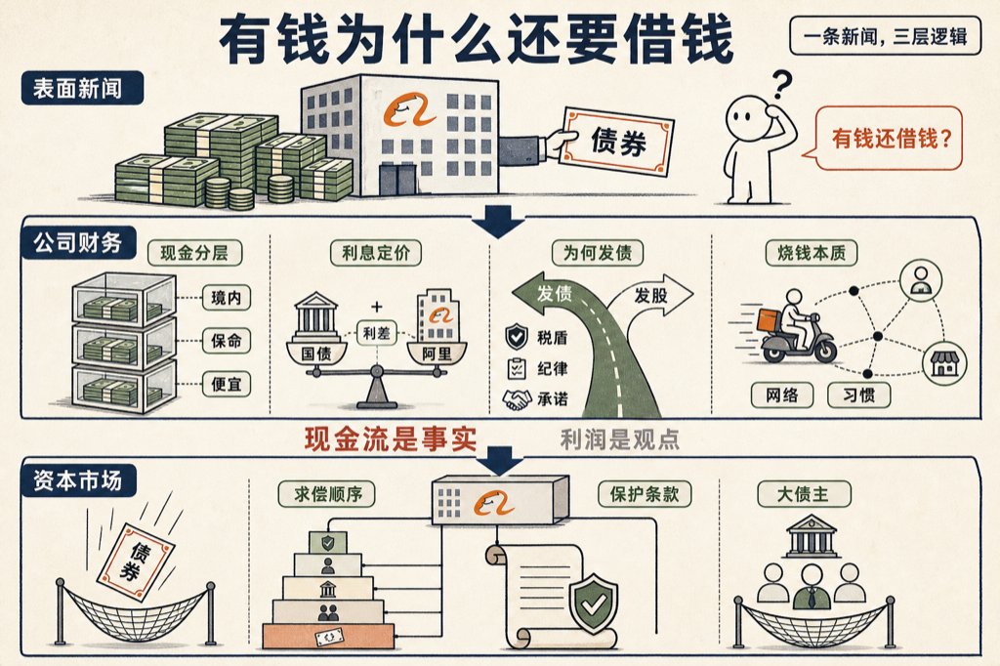

阿里账上趴着几千亿现金，转头发了 100 亿美元的债。

有钱为什么还要借钱？这条新闻大部分人划过去了，但它背后是一整套大公司的金钱逻辑。我让 VoiceDrop 把它写成了一本书：《有钱为什么还要借钱》，十二章，从这一张债券讲到整个资本市场。

书里把几个问题讲透了：

- 现金是分层的：境内的钱出不来，保命的钱不能动，便宜的钱不借白不借。
- 利息怎么定：无风险利率打底，信用利差加点——阿里借美元只比美国政府贵一点。
- 为什么宁可背债也不发股票：税盾、纪律，和「借钱的承诺」本身值钱。
- 外卖大战烧的不是钱，是在买履约网络和用户习惯。
- 如果真不还钱会怎样：求偿顺序、保护条款，大债主为什么很少血本无归。

书里我最喜欢的一句：会计利润是观点，现金流是事实。

先说实话：这本书是 AI 写的。我出题，几个 AI 代理分头写、互相审校。

书就嵌在下面，点卡片直接读：

<mp-miniprogram data-miniprogram-appid="wxedfbd113b545b4f6" data-miniprogram-path="/pages/book-reader/index?slug=borrow-when-rich&title=%E6%9C%89%E9%92%B1%E4%B8%BA%E4%BB%80%E4%B9%88%E8%BF%98%E8%A6%81%E5%80%9F%E9%92%B1&main=%E6%9C%89%E9%92%B1%E4%B8%BA%E4%BB%80%E4%B9%88%E8%BF%98%E8%A6%81%E5%80%9F%E9%92%B1&author=%E7%8E%8B%E5%BB%BA%E7%A1%95&cover=1&coverAt=1787566492752" data-miniprogram-title="有钱为什么还要借钱" data-miniprogram-imageurl="http://mmbiz.qpic.cn/sz_mmbiz_jpg/x701icxIMoQPXwSpDrzhBMfal5MyGdLKol0C4KWOmG4UiaetQicznclljDU5zk1UlptyJI4QZds7jqUQXvotRoJbxdYGFDEUQ0CkeBVPCkmcBs/0?wx_fmt=jpeg"></mp-miniprogram>

同一条财经新闻，读完这本书，你能看出三层。

