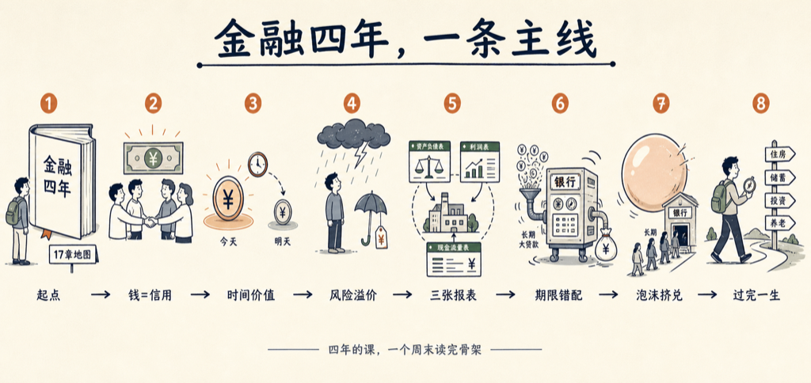

金融系的本科四年，到底在学什么？

我一直觉得，把一个专业压缩到极限，剩下的就是十几个核心观念。我让 VoiceDrop 做了这个实验：把金融本科四年装进一本书。书名就叫《金融四年》，十七章。

从第一章到最后一章，其实是一条线：

- 钱的本质是信用，不是纸。
- 今天的一块钱比明天的一块钱值钱——整个金融都建立在这句话上。
- 风险是一件要付钱的商品，风险溢价就是它的价格。
- 三张报表讲的是同一个故事的三个角度。
- 银行是一台错配机器，靠错配赚钱，也因错配倒下。
- 泡沫、挤兑，和「这次不一样」，为什么反复上演。

最后一章回到正题：一个普通人该怎么用这套知识过完一生。

先说实话：这本书是 AI 写的。我出题，几个 AI 代理分头写、互相审校，费曼式的写法——每一章都要讲到一个外行能听懂为止。

拿它当教材不够，拿它当地图刚好。四年的课，一个周末读完骨架，哪里感兴趣再去深挖。

书就嵌在下面，点卡片直接读：

<mp-miniprogram data-miniprogram-appid="wxedfbd113b545b4f6" data-miniprogram-path="/pages/book-reader/index?slug=finance-four-years&title=%E9%87%91%E8%9E%8D%E5%9B%9B%E5%B9%B4&main=%E9%87%91%E8%9E%8D%E5%9B%9B%E5%B9%B4&author=%E7%8E%8B%E5%BB%BA%E7%A1%95&cover=1&coverAt=1787752800820" data-miniprogram-title="金融四年" data-miniprogram-imageurl="http://mmbiz.qpic.cn/sz_mmbiz_jpg/x701icxIMoQOjPztbRdkmVOicCiawcb7B0gog4a8ccrEiazfBI0eVIkXxI00WLgVYeeT1glia21ephhMgibwQ8kURiaPedDQZzlt5oiapLXIdHalBSA/0?wx_fmt=jpeg"></mp-miniprogram>

