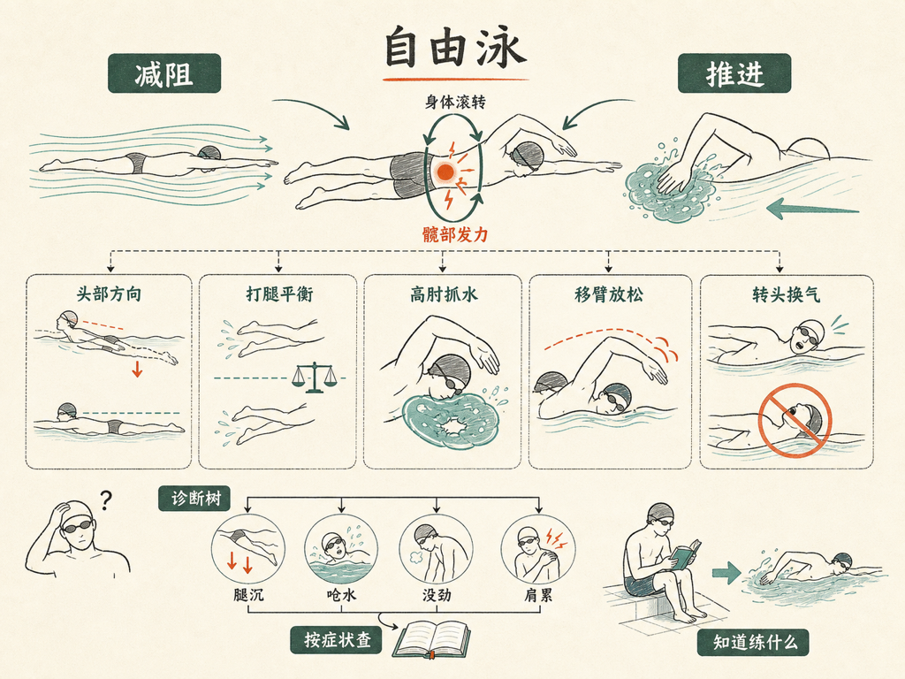

自由泳的全部技术，其实就两件事：减阻，和推进。

听起来简单，做起来每个部位都能出错。我让 VoiceDrop 写了一本《自由泳详解》，十二章，把身体拆成零件，一个部位一个部位讲清楚。

最颠覆我直觉的一句：不是手在游泳，是身体绕着纵轴在滚，髋部才是动力源头。

其他几个地方也值得单拎出来：

- 头是全身的方向盘：头一抬，腿就沉，脖子是最便宜的纠偏器。
- 打腿是一把不指望推进的桨，它的主要工作是维持身体位置。
- 高肘抓水，是抓住一坨水，而不是划过一坨水。
- 移臂不是为了好看，是让肩膀休息、让动量不丢。
- 换气是转头，不是抬头——波谷里就有空气。

最后一章是一棵诊断树：按症状找章节，你的问题在第几章，一查就知道。

先说实话：这本书是 AI 写的。我出题，几个 AI 代理分头写、互相审校。它不能替你下水，但能让你下水的每一趟都知道自己在练什么。

书就嵌在下面，点卡片直接读：

<mp-miniprogram data-miniprogram-appid="wxedfbd113b545b4f6" data-miniprogram-path="/pages/book-reader/index?slug=freestyle-detail&title=%E8%87%AA%E7%94%B1%E6%B3%B3%E8%AF%A6%E8%A7%A3&main=%E8%87%AA%E7%94%B1%E6%B3%B3%E8%AF%A6%E8%A7%A3&author=%E7%8E%8B%E5%BB%BA%E7%A1%95&cover=1&coverAt=1787636257905" data-miniprogram-title="自由泳详解" data-miniprogram-imageurl="http://mmbiz.qpic.cn/sz_mmbiz_jpg/x701icxIMoQM80rmKEoyP5viafyHibz5SZfInrjkHicMcXx0dDicSMG5ONWXMPXAECKYq01eHxKF3SIdEf4mhuEhQqTciatDLlgibhdZhM4iciazPDwM/0?wx_fmt=jpeg"></mp-miniprogram>

