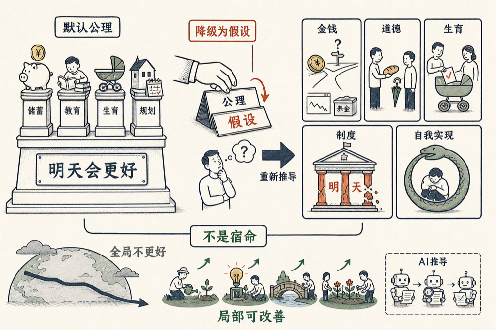

「明天会更好」这句话，我们从来不检查。它不是结论，是公理——所有的规划、储蓄、教育、生孩子，都建在它上面。

我想做一个思想实验：把「明天会更好」从公理降级为假设，然后把这个世界重新推导一遍，看看哪些东西还站得住。

我把这个实验丢给 VoiceDrop，让他写成了一本书：《如果人类不会更好》，十二章。

推导出来的东西，比我预想的锋利：

- 储蓄、养老金、股市，全都押在「未来更大」上——抽掉这个假设，钱不知道该往哪放。
- 善行不再由「未来会更好」报销：道德要么当下就值，要么不值。
- 孩子是一张看涨期权，生育是对未来的投票。
- 制度的合法性，长期靠透支「明天」来融资。
- 相信「不会更好」这件事本身，会制造「不会更好」——公理会咬自己的尾巴。

也要说清楚：这本书是 AI 写的。我出题，几个 AI 代理分头写、互相审校。它不预测未来，只做推导。

最后一章我最喜欢：公理不等于宿命，全局不更好，不等于局部不可改善。

书就嵌在下面，点卡片直接读：

<mp-miniprogram data-miniprogram-appid="wxedfbd113b545b4f6" data-miniprogram-path="/pages/book-reader/index?slug=no-progress-axiom&title=%E5%A6%82%E6%9E%9C%E4%BA%BA%E7%B1%BB%E4%B8%8D%E4%BC%9A%E6%9B%B4%E5%A5%BD&main=%E5%A6%82%E6%9E%9C%E4%BA%BA%E7%B1%BB%E4%B8%8D%E4%BC%9A%E6%9B%B4%E5%A5%BD&author=%E7%8E%8B%E5%BB%BA%E7%A1%95&cover=1&coverAt=1787846810804" data-miniprogram-title="如果人类不会更好" data-miniprogram-imageurl="http://mmbiz.qpic.cn/sz_mmbiz_jpg/x701icxIMoQP1XYckevu7NynAkYKYjy3R3f0C6Mdeiam8xrnJS3UOSRgKkL5ExnIhwIVzbaDIZLDecY4MiaNB0hd4R7TNMIQ23ianQ3gxmEtceo/0?wx_fmt=jpeg"></mp-miniprogram>

