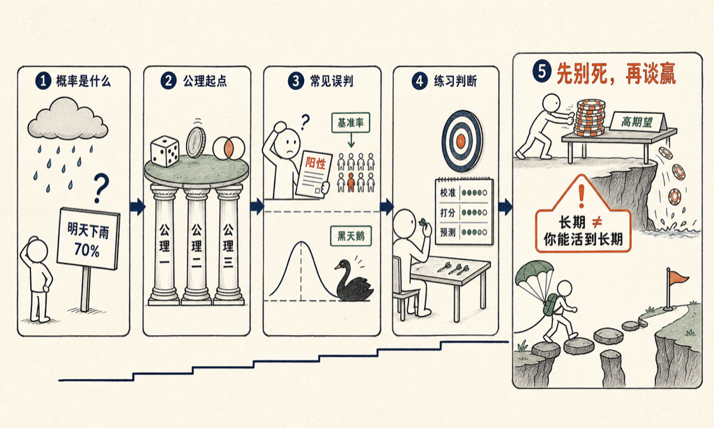

「明天下雨概率 70%」——这句话到底什么意思？明天只下一次雨，70% 从哪来？

大部分人每天都在用概率这个词，但很少有人被系统地教过它。我让 VoiceDrop 写了一本书：《概率：与不确定共处》，十二章，从三条公理讲到凯利判据，写给理工读者。

书里几个值得反复读的地方：

- 整个概率论只需要三条公理，柯尔莫哥洛夫用它们撑起一切。
- 看到阳性结果，你真得病的概率可能很低——基准率的复仇。
- 正态分布是一个温柔的谎言，黑天鹅在数学上其实不黑。
- 概率是可以练习的手艺：校准、打分、预测锦标赛。
- 期望值是起点，不是终点。

最扎我的一句：大数定律保证了长期，但你未必活得到长期。时间平均和系综平均，是两回事。

先说实话：这本书是 AI 写的。我出题，几个 AI 代理分头写、互相审校。

最后一章的标题，可以当座右铭用：先别死，再谈赢。为什么全押期望值最高的选项，是一条通往归零的路——答案在书里。

书就嵌在下面，点卡片直接读：

<mp-miniprogram data-miniprogram-appid="wxedfbd113b545b4f6" data-miniprogram-path="/pages/book-reader/index?slug=probability&title=%E6%A6%82%E7%8E%87%EF%BC%9A%E4%B8%8E%E4%B8%8D%E7%A1%AE%E5%AE%9A%E5%85%B1%E5%A4%84&main=%E6%A6%82%E7%8E%87&author=%E7%8E%8B%E5%BB%BA%E7%A1%95&cover=1&coverAt=1787572399253" data-miniprogram-title="概率：与不确定共处" data-miniprogram-imageurl="http://mmbiz.qpic.cn/sz_mmbiz_jpg/x701icxIMoQNb0txv31PKRbCa5YyoPgbia9Xed0zqk1dTh4Lv3qYup6ibemaR9bBmBGD5Z52z2tF1cwphlZFJEHWjAbhUSJL8rOb2t1ZjyYFQQ/0?wx_fmt=jpeg"></mp-miniprogram>

