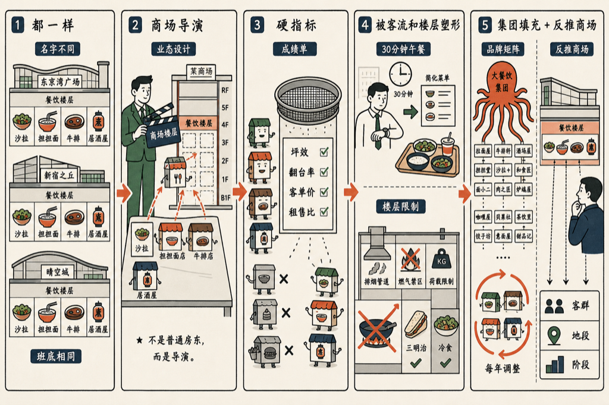

在东京逛商场，我发现一个规律：换一个商场，餐饮楼层永远是同一套班底——一家沙拉店，一家担担面，一家牛排馆，一家居酒屋。

日比谷是这样，东京站是这样，大手町还是这样。名字五花八门，类型一成不变。

为什么？我把这个问题丢给 VoiceDrop，让他写成了一本书：《东京商场里的那几家店》，十二章。

答案比我猜的有意思：

- 商场不是房东，是导演：业态组合是设计出来的，不是谁出钱谁进。
- 每家店都要交成绩单：坪效、翻台率、客单价、租售比，硬指标筛掉大部分餐厅。
- 写字楼白领的午餐只有 30 分钟，客流的形状决定菜单的形状。
- 有些楼层不能炒菜：排烟、燃气、荷载，把它们推向三明治和冷厨房。
- 名字不同，班底相同：一个餐饮集团手里攥着几十个品牌，填进每个商场。
- 餐饮楼层每年都要换掉几家——它是一个不断再平衡的投资组合。

先说实话：这本书是 AI 写的。我出题，几个 AI 代理分头写、互相审校。

读完你可以从一层餐饮班底，反推出这个商场的客群、地段和阶段。逛商场从此多了一个玩法。

书就嵌在下面，点卡片直接读：

<mp-miniprogram data-miniprogram-appid="wxedfbd113b545b4f6" data-miniprogram-path="/pages/book-reader/index?slug=tokyo-mall-food-cast&title=%E4%B8%9C%E4%BA%AC%E5%95%86%E5%9C%BA%E9%87%8C%E7%9A%84%E9%82%A3%E5%87%A0%E5%AE%B6%E5%BA%97&main=%E4%B8%9C%E4%BA%AC%E5%95%86%E5%9C%BA%E9%87%8C%E7%9A%84%E9%82%A3%E5%87%A0%E5%AE%B6%E5%BA%97&author=%E7%8E%8B%E5%BB%BA%E7%A1%95&cover=1&coverAt=1787560647543" data-miniprogram-title="东京商场里的那几家店" data-miniprogram-imageurl="http://mmbiz.qpic.cn/mmbiz_jpg/x701icxIMoQN7wJ91ia9zxwe0FmqNiahib6Oq1WrXTMcx7ZBTEaubDfEnboTZPKwPMJ3q7GnVSxg1WibLjG0fn2iabzEuh4M5CDNz7AEkqHpV4JBM/0?wx_fmt=jpeg"></mp-miniprogram>

