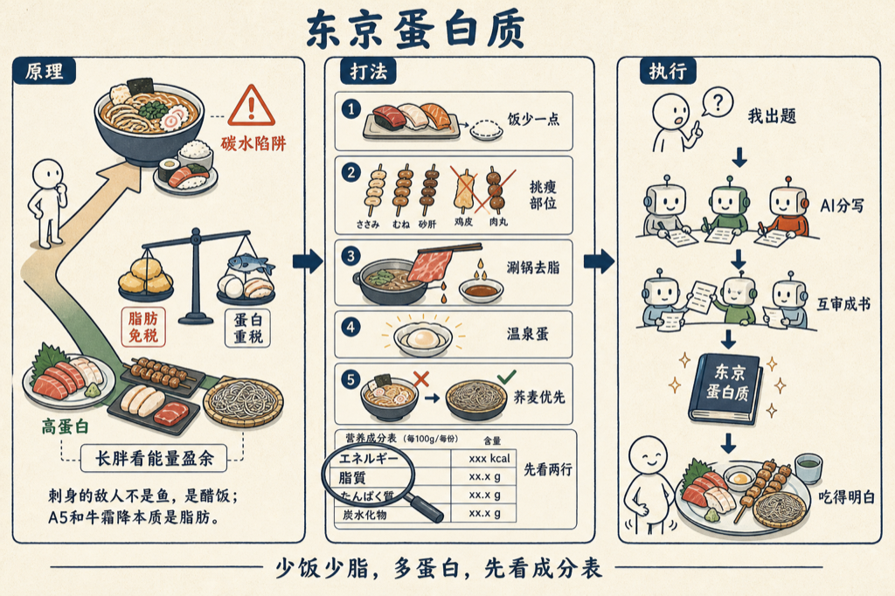

在东京，想吃得高蛋白、高品质、又不长胖，是有一套打法的。

我在东京吃了很多顿饭，慢慢摸出一些门道：刺身的敌人不是鱼，是那口醋饭；A5 和牛的「霜降」，本质是脂肪认证；便利店的高蛋白货架，比很多餐厅都靠谱。

我让 VoiceDrop 把这套门道写成了一本书：《东京蛋白质》，十二章。

书里我用得最多的几条：

- 点寿司学会说「シャリ少なめ」（饭少一点），蛋白照吃，碳水减半。
- 烧鸟点部位：ささみ、むね、砂肝，配盐味；鸡皮和つくね是自己点回来的坑。
- 涮涮锅配ポン酢，是唯一能物理去脂的和牛吃法。
- 温泉蛋是鸡蛋吸收率的最优解。
- 乌冬和拉面是碳水陷阱，十割荞麦是唯一可以放心吃的面。
- 营养成分表上最容易看错的两行：エネルギー和脂質。

先说实话：这本书是 AI 写的。我出题，几个 AI 代理分头写、互相审校。

书就嵌在下面，点卡片直接读：

<mp-miniprogram data-miniprogram-appid="wxedfbd113b545b4f6" data-miniprogram-path="/pages/book-reader/index?slug=tokyo-protein&title=%E4%B8%9C%E4%BA%AC%E8%9B%8B%E7%99%BD%E8%B4%A8&main=%E4%B8%9C%E4%BA%AC%E8%9B%8B%E7%99%BD%E8%B4%A8&author=%E7%8E%8B%E5%BB%BA%E7%A1%95&cover=1&coverAt=1787718511929" data-miniprogram-title="东京蛋白质" data-miniprogram-imageurl="http://mmbiz.qpic.cn/sz_mmbiz_jpg/x701icxIMoQN6X8TJfsW8oic0dLBFuoeVrZicufNLTTO42jUZgk6tWhjEPK92OVtpvic5krTnAYeEicYVibGdQHpnofuTvddD3OtXTiaibNS1dEbQno/0?wx_fmt=jpeg"></mp-miniprogram>

长胖赖的是能量盈余，但脂肪几乎免税、蛋白质重税。

