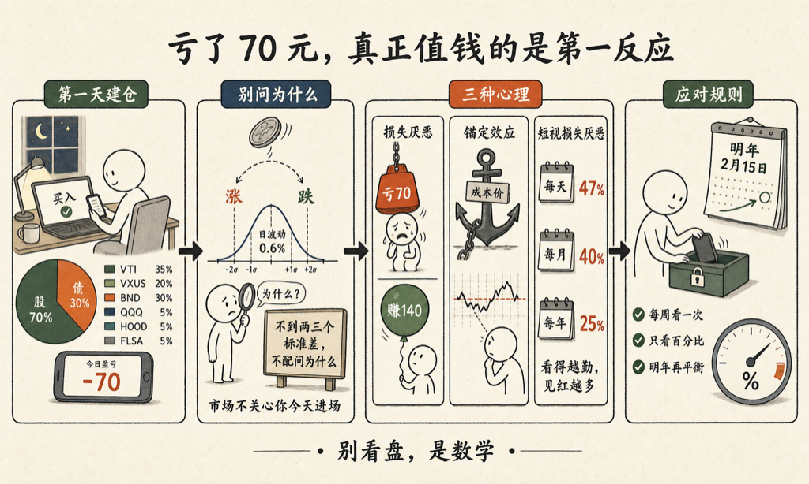

今天我开始正经买美股，入金两万美元。晚上建仓，睡前打开 App 看了一眼：亏了 70 块。

我的第一反应是想知道为什么。然后我意识到，这个反应本身，比那 70 块钱值钱多了。

先交代怎么分的。方案是老老实实的股债七三，五笔全用限价单，开盘 15 分钟后才下手：

| 标的 | 是什么 | 仓位 |
|---|---|---|
| VTI | 美国全市场 3600 家公司 | 35% |
| VXUS | 美国以外 8500 家公司 | 20% |
| BND | 一万多张美国投资级债券 | 30% |
| QQQ | 纳指 100 | 5% |
| HOOD | 个股练手，预先当它归零 | 5% |
| FLSA | 沙特，下周一补 | 5% |

账是这么算的：期初 20,100，手续费 10 块 4，浮亏 70 块 3，剩 20,019。手续费占 0.056%，一次性，约等于这些基金一整年的管理费。

那 70 块占本金 0.38%。这是多还是少？我算了一下这个组合的日波动率，大约 0.6%——也就是说，今天这一下只有 0.6 个标准差。

不到两三个标准差的波动，不配拥有「为什么」。问 HOOD 为什么今天跌 2%——它过去一年里 63% 的日子单日波动都超过 2%——跟问今天为什么比昨天低一度，是同一个问题。

**那为什么第一天偏偏是跌，不是涨呢？**

答案很扫兴：掷硬币输了。历史上大约 47% 的交易日收跌，市场不知道、也不关心我今天进场。

真正有意思的是另一半：我为什么这么在意？这一半有三个名字。

- 损失厌恶：亏 70 块的痛，约等于赚 140 块的爽。今天要是涨了 70 块，我根本不会截图。
- 锚定效应：第一天，锚死死钉在成本价上，每一分钱的偏离都清清楚楚。
- 短视损失厌恶：每天看一次盘，47% 的日子见红；每月看一次，四成；每年看一次，只有四分之一。看得越勤，见红越多，而每一次红，心里都按双倍计费。

所以「别看盘」不是修养，是数学。

我给自己定的规矩：每周只看一次，看百分比不看金额；下一个动手的日子是明年 2 月 15 日，再平衡。

睡前又看了一眼那个 -70.33。这个游戏好玩——好玩的不是数字，是数字亮出来那一秒，看见自己的第一反应。

<!--RECENT_ARTICLES_START-->
<section style="margin-top:28px;padding-top:16px;border-top:1px solid #e5e5e5;"><strong style="color:#ff0000;">扩展阅读</strong> <a class="normal_text_link mp_article_text_link" target="_blank" style="" href="https://mp.weixin.qq.com/s/z9y-hni6X3cxCWq5CX4XHA" textvalue="让网站自己改自己的技能" data-itemshowtype="0" linktype="text" data-linktype="2">让网站自己改自己的技能</a> <a class="normal_text_link mp_article_text_link" target="_blank" style="" href="https://mp.weixin.qq.com/s/Fk65JcazCpv59JePhfaXbQ" textvalue="ccglass 0.6.0 版本新功能" data-itemshowtype="0" linktype="text" data-linktype="2">ccglass 0.6.0 版本新功能</a> <a class="normal_text_link mp_article_text_link" target="_blank" style="" href="https://mp.weixin.qq.com/s/QKZm26DIGwGjm3McOlkCQw" textvalue="「Agent本质是一个死循环」：一句话告诉你什么是 Agent" data-itemshowtype="0" linktype="text" data-linktype="2">「Agent本质是一个死循环」：一句话告诉你什么是 Agent</a> <a class="normal_text_link mp_article_text_link" target="_blank" style="" href="https://mp.weixin.qq.com/s/y7kQ0J46lDjXO3Ojn5L73g" textvalue="效率越高，需求越井喷" data-itemshowtype="0" linktype="text" data-linktype="2">效率越高，需求越井喷</a> <a class="normal_text_link mp_article_text_link" target="_blank" style="" href="https://mp.weixin.qq.com/s/-HK2ymNH3bhun-zQ65cmBQ" textvalue="改指令，不要改产物" data-itemshowtype="0" linktype="text" data-linktype="2">改指令，不要改产物</a></section>
<!--RECENT_ARTICLES_END-->
