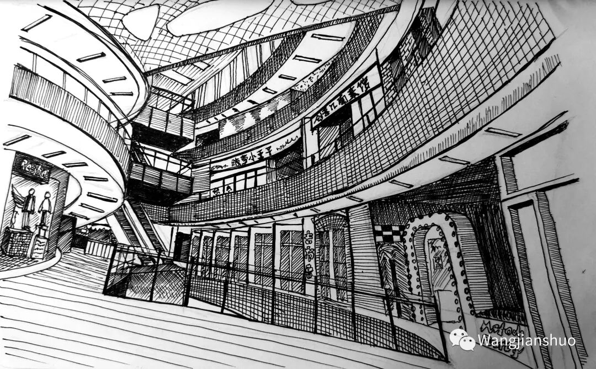
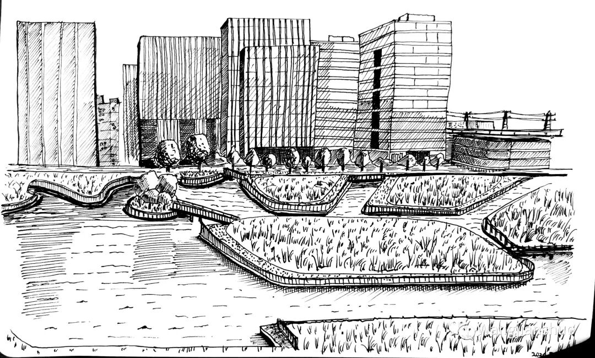
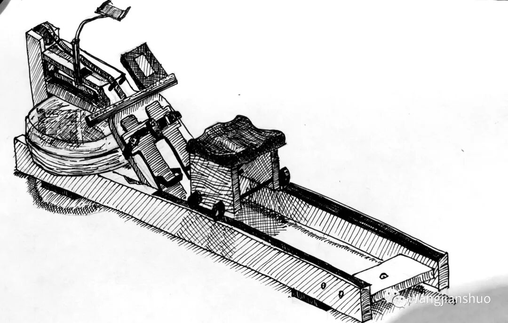

# 维璟广场商场和西子国际办公楼群

这副画对我是一个巨大的挑战，难度有二。其一，这是我第一次尝试三点透视，其实是多点透视。最主要是左右的垂直的墙都倾斜，最终汇集到天花板之上的一点，以体现仰视的感觉。同时因为是圆形的建筑，即便是直线的形状（比如内部的露台，灯管）灭点也都不一样。其二，大量的弧线，左右的主要的线条都是椭圆。我又不擅长画椭圆。最终这副对我来说相当恢宏的工程顺利完工，算是有惊无险。

这是从维璟中心向南望过去的西子国际办公群楼。得到的经验是，这样的缺少轮廓个性的方盒子画出来也一样没有什么趣味。倒是第一次画了草地。

这是家里面的划船机。明暗依然比较单薄。