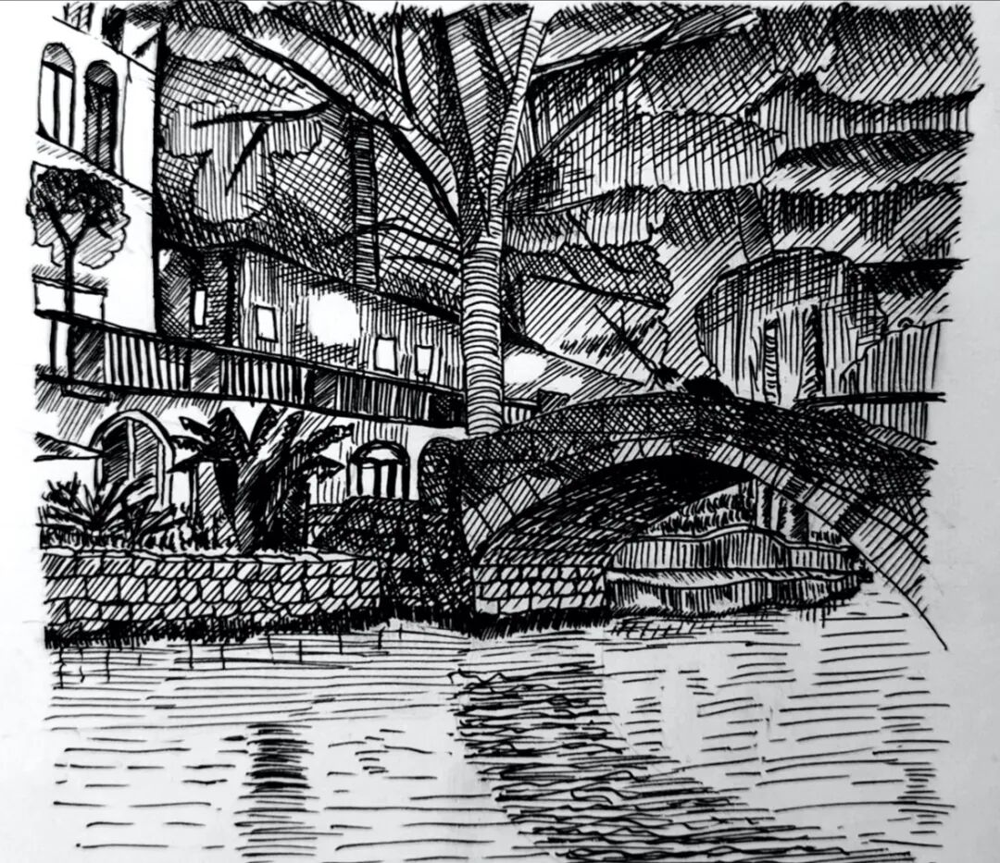
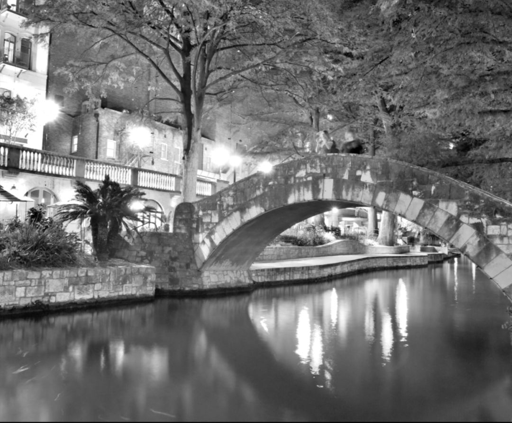
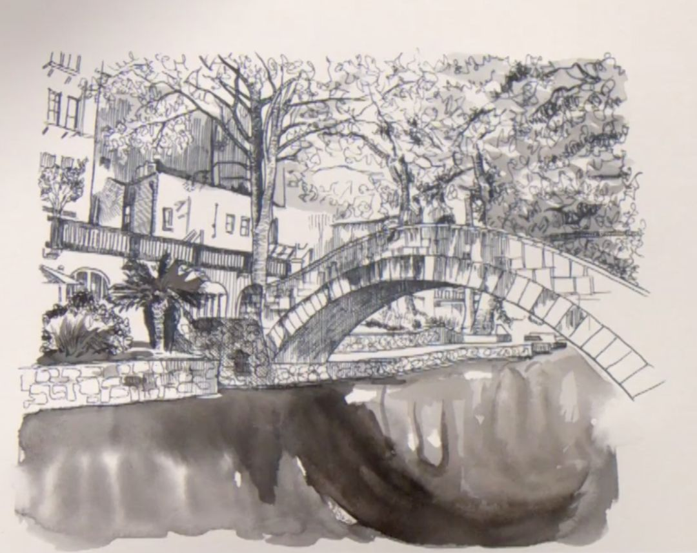

# 桥和水练习

这是一幅练习图，原图是下面的这张，是Paul Heaston（我最喜欢的街景素描画家）在他的视频里面讲解的原照片。

我把这个当作考试，先自己画了一幅，然后再看视频比较一下。下面是他的最终作品。和他的距离还是有点远呀。。。

记录一下几个错误：

容易在纵向拉长。这个还是习惯于不遵从眼睛而是遵从大脑有关。

轮廓线阶段不完整。尤其是植物，房子等。没有形成完整的作品，就开始加色调。

明暗不清晰，画之前没有观察好。

因为是夜景图结果就全画成暗的色调了，就好像有时候是白天太阳下就全是留白了一样。没有对比就没有明暗。

等等。。。。