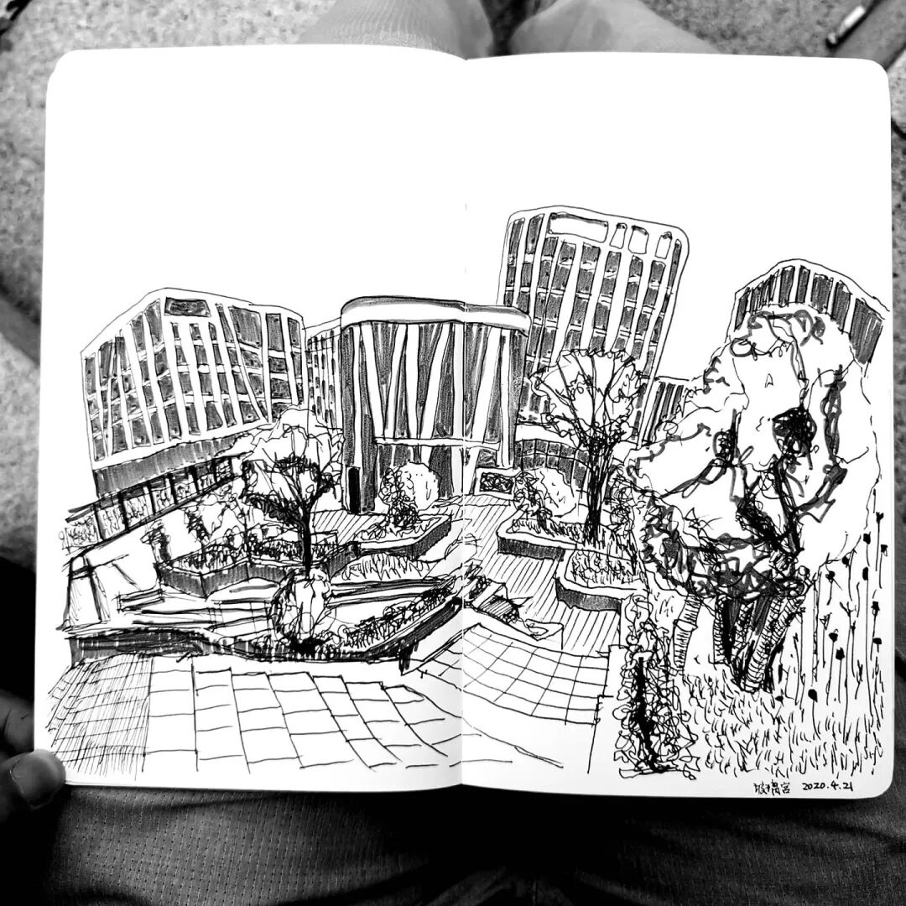
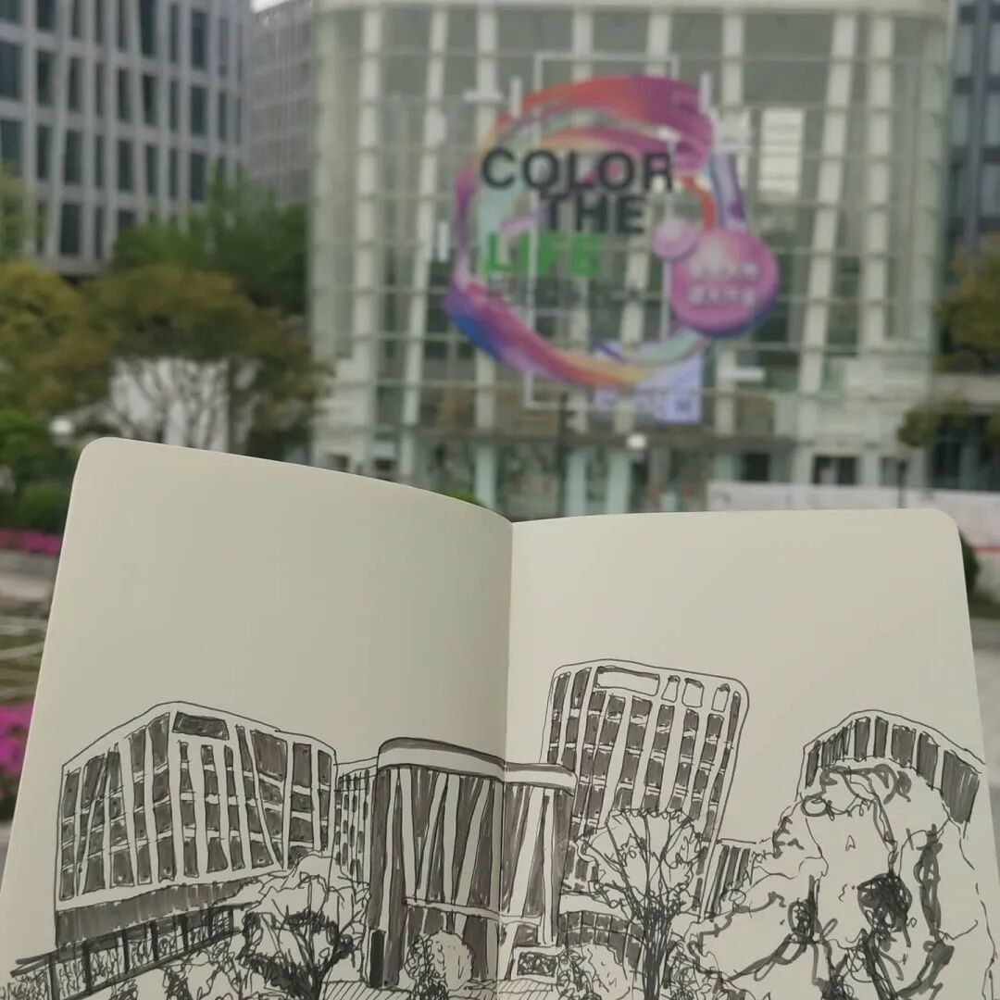

# 玻璃宫艺术书店

画了100张工程图纸一样的严格透视，线条工整的画以后，我开始尝试真的开始“画画”了。就是开始完全随着眼睛，甚至画得时候眼睛不会一直在笔尖，不思考透视，直接从眼睛直接到手的方式。这是这种方式的一开始的尝试。从结果而论，我更喜欢已经渐入佳境的工程方式，但是从过程来说，我更喜欢这中心的方式。前者更像答题，而后者更像微醺的状态。我想或许我做了100张这样的练习之后也会更加喜欢这种画法的结果。

